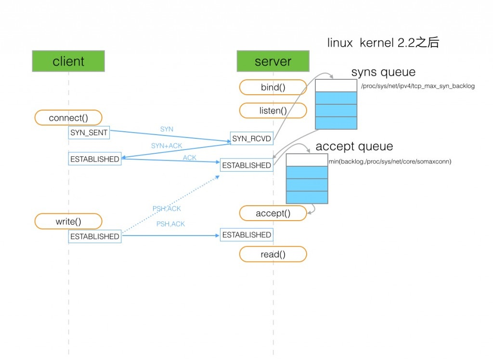

## TCP三次握手
[](https://travis-ci.org/GuozhuHe/webspider)
* client发送SYN到server，将状态修改为SYN_SEND，如果server收到请求，则将状态修改为SYN_RCVD，并把该请求放到syns queue队列中。
* server回复SYN+ACK给client，如果client收到请求，则将状态修改为ESTABLISHED，并发送ACK给server。
* server收到ACK，将状态修改为ESTABLISHED，并把该请求从syns queue中放到accept queue。
```bash
syns queue(半连接队列）：
用于保存半连接状态的请求，其大小取决于max(64, /proc/sys/net/ipv4/tcp_max_syn_backlog)，不过这个设置有效的前提是系统的syncookies功能被禁用。
accept queue（全连接队列）：
用于保存全连接状态的请求，其大小取决于min(backlog, somaxconn)，backlog是在socket创建的时候传入的参数，somaxconn是一个os级别的系统参数（通过/proc/sys/net/core/somaxconn指定）。

TCP连接队列溢出：
若accpet queue队列满了则按tcp_abort_on_overflow的指示执行，默认server将发送一个ECONNREFUSED错误信息Connection refused给client；当tcp_abort_on_overflow=0 时server过一段时间再次发送syn+ack给client。

```
若TCP连接队列溢出，有哪些指标可以看呢？
```bash
[root@server ~]#  netstat -s | egrep "listen|LISTEN" 
667399 times the listen queue of a socket overflowed
667399 SYNs to LISTEN sockets ignored

比如上面看到的 667399 times ，表示全连接队列溢出的次数，隔几秒钟执行下，如果这个数字一直在增加的话肯定全连接队列偶尔满了。

[root@server ~]# ss -lnt
Recv-Q Send-Q Local Address:Port  Peer Address:Port 
0        50               *:3306             *:* 

上面看到的第二列Send-Q 表示第三列的listen端口上的全连接队列最大为50，第一列Recv-Q为全连接队列当前使用了多少。
```
若走完三次握手第三步后，在client看来连接已经建立好了，但是server上由于其他原因（比如全连接队列满了）导致对应连接实际没有准备好，这个时候如果client发数据给server，server会怎么处理呢？
```bash
server忽略这些包，然后client重传，一定次数后client认为异常，然后断开连接。
```
DUBBO相关问题？
A系统的DUBBO服务被大量客户端引用，当A系统一发布(或者重启)，就会出现DUBBO客户端请求超时的问题，而且每个DUBBO客户端是第一次请求超时，之后请求都正常。
```bash
客户端日志如下：
2019-08-22 20:33:50.798
com.alibaba.dubbo.rpc.RpcException:
	Failed to invoke the method set in the servce XXXFacade,
	tries 1 times
	......
	start time: 2019-08-22 20:32:50.474
	end time: 2019-08-22 30:33:50.767 
	timeout=60000,channel:/21.64.21.164:44502->21.64.35.75:20880

我们在客户端服务器观察连接状态为正常：
[root@test ~]#  netstat -anp | grep 44502
21.64.21.164:44502 21.64.35.75:20880 ESTABLISHED
```
其原因就是A系统启动后向注册中心注册自己，对应消费客户端Watch都会收到通知发起TCP连接，对于A系统出现突发大批量TCP创建连接（非平滑问题），导致全连接队列溢出，客户端的三次握手后的连接实际不可用，且在未收到服务端反馈就发送了请求。
