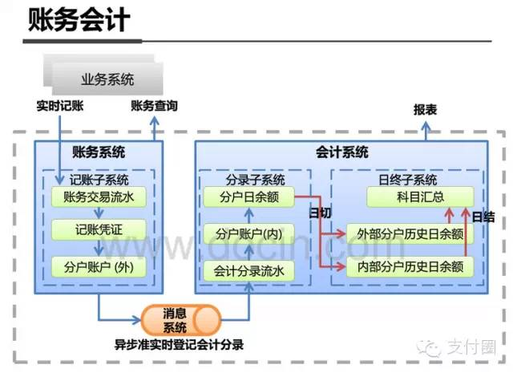

# 


# 收银台

# 支付处理

# 账务+会计

* 分户账户（内/外）
```
分户账（外）是外围业务系统的账户系统，采用单式记账法，主要记录业务流水。
应用于账务系统，采用实时记账：
a. 提供给商户或用户实时查询账户余额等信息。
b. 为特殊业务做定制或扩展，一般与业务绑定（零钱账户/红包账户/理财账户/等）。

分户账（内）是最核心的账户系统，采用复式记账法，主要记录分录结构账务。
应用于会计系统，采用异步记账：
a. 不涉及太多的业务逻辑，因此可以保证核心账户系统的稳定性。
b. 其涉及会计分录等过程，在并发量大的情况下，如果仍然采用实时记账方式，会造成数据库资源的锁等待、热点账户等问题，通过异步、准实时/延时/批量记账等措施，可以避免系统的性能瓶颈。

账务平衡检查：
通过分户账（内）和分户账（外）日终的余额试算平衡，来保证账户系统的平衡。
```
* 记账子系统
```
围绕业务记录具体流水，同时可提供一定业务逻辑。如一家支付公司的钱包搭载的不同应用渠道，但钱包实名后余额不共享，主要因为记账子系统里关联的分户账（内）不同。
其主要数据包含账务交易流水、记账凭证及分户账户（外）信息。
```
```
如何实现快速记账？


如何实现数据完成性和一致性？


```
* 分录子系统
```
脱离具体业务本身，按照会计标准在一个账户内提供结构帐，以及对应的会计分录，如资产类账户、权益类账户、成本类账户等。
比如在转入交易时就可以记：借 资产类账户 贷 权益类账户，查资产就可以直接查资产类账户的余额，同时根据借贷平衡来保证账务不会出错。
```

* 日终子系统
```
日切后批量统计，为数据报表分析提供支持，也可以处理一些历史数据或者数据处理量大（不适合白天运行）的需求。
自动入账：
生成总账：
总账平衡检查：

```

