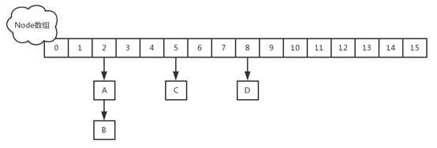
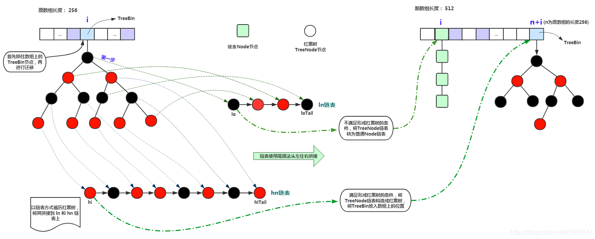

# HashMap
* 关键参数
```
容量（capacity）：
默认为16，数值应取2的幂，因为采用XX（二进制运算比取模运算更高效） ，2的幂减一转换为2进制时，所有位上全为1，做散列时可以使哈希分布更加随机。

负载因子（loadFactor）：
默认是 0.75，当现有容量大于总容量 * 负载因子时，需要对其扩容（原两倍）。

节点数据结构转换阈值（TREEIFY_THRESHOLD=8）：
节点的链表长度超过八个时会自动转化为红黑树，当删除节点时小于六时重新变为链表。
原因是节点分布在hash桶中的频率遵循泊松分布，根据泊松分布，在负载因子默认为0.75的时候，单个hash槽内元素个数为8的概率小于百万分之一，所以将7作为一个分水岭，等于7的时候不转换，大于等于8的时候才进行转换，小于等于6的时候就化为链表。
```
* 数据结构
```
HashMap采用数组+链表的结构实现，相同hash值的元素存储在一个链表里。
```
* 如何扩容
```
a. 添加元素时检查发现容量不足。
b. 保存旧数组（oldTab）。
c. 创建新数组（newTab），原容量的两倍。
d. 将旧数组中的元素（键值对）转移到新数组中。
d1. 遍历旧数组中的元素。
d2. 重新计算每个元素在新数组中的存储位置。
d3. 将旧数组中的元素逐个转移到新数组中，jdk1.7采用头插法、jdk8采用尾插法。
e. 新数组 newTab 引用到 HashMap 对象的 table 属性上。
f. 重新设置扩容阈值（threshold）。
```

* 并发扩容时如何形成闭环？
```
do {
    Entry<K,V> next = e.next;    //假设线程一执行到这里就被调度挂起了
    int i = indexFor(e.hash, newCapacity);
    e.next = newTable[i];
    newTable[i] = e;
    e = next;
} while (e != null);

导致出现闭环的原因是线程一被挂起时是仍然保留原链表的当前元素e和下一个元素next，而线程二扩容完成以后由于采用头插法已经将当前元素e和下一个元素next位置进行互换，这样导致线程一在扩容过程中会将当前元素e进行两次处理。
```
* jdk1.8的变化
```
a. 当链表长度过大时，查询效率很低，所以 jdk1.8 增加了红黑树结构，当链表长度大于阈值 8 时会转为红黑树，而红黑树元素个数小于 6 时又会转为链表结构。
b. 扩容时，jdk1.7采用头插法、jdk8采用尾插法。
c. 扩容迁移时存储位置的计算方式：
jdk1.7：

jdk1.8：
若 hash & (oldTab.length - 1) == 0 ，元素或链表在新数组的位置与老数组中的位置相同，即newTab[j] = oldTab[j]；
若 hash & (oldTab.length - 1) != 0 ，元素或链表在新数组的位置等于原老数组的位置加上老数组的长度，即newTab[j+oldTab.length] = oldTab[j]；
```
* 并发下的解决方案
```
a. 采用Hashtable
区别：？？？ 键值为NULL。

b. Collections.synchronizedMap(Map)
在SynchronizedMap内部维护了一个普通对象Map和排斥锁mutex，通过synchronizedMap创建出map对象之后，会对所有的操作通过 synchronized 上锁。

c. ConcurrentHashMap
略
```
# ConcurrentHashMap
* jdk1.7
```
由Segment数组结构和HashEntry数组结构组成，其中Segment继承自可重入锁ReentrantLock，HashEntry类似于HashMap结构，用于存储键值对数据，它通过锁分离的方式支持更高的并发度。
```
* 关键参数
```
a. initialCapacity表示初始容量大小 ，默认16。
b. loadFactor表示负载因子，默认0.75，当现有容量大于总容量 * 负载因子时，容量翻倍。
c. concurrencyLevel表示并发度，默认为16，实际就是Segment[]数组长度，即分段个数。
```

* jdk1.8
```
摒弃了Segment的概念，而是直接采用Node数组+链表或红黑树的数据结构来实现，并发控制使用Synchronized和CAS来操作。
```

* 关键参数
```
sizeCtl属性在各阶段的作用：
a. 新建而未初始化
sizeCtl 等于容量，用于记录初始容量大小（初始化时使用）。
b. 初始化过程
将 sizeCtl 值设置为 -1 表示集合正在初始化中，其他线程发现该值为 -1 时会让出CPU资源以便初始化操作尽快完成。
c. 初始化完成
sizeCtl 用于记录当前集合的负载容量值，也就是触发集合扩容的极限值。
d. 扩容过程
sizeCtl 用于记录当前扩容的并发线程数。

```
* 如何计算下标
```
a. 两次hash
hash = spread(key.hashCode())

b. 计算下标
i = (n - 1) & hash
```
* PUT过程
```
for(;;) {
a. 检查table是否初始化。
- 未初始化：调用initTable方法进行初始化，之后重新进入(re-in)。
- 已初始化：往下继续。
b. 检查指定位置是否为NULL。
- 不存在元素：采用CAS无锁方式插入新元素，并退出(break)。
- 存在元素：往下继续。
c. 检查是否正在扩容。
- 正在扩容：当前线程加入扩容过程，完成扩容后重新进入(re-in)。
- 未在扩容：往下继续。
d. 通过 synchronized 锁住链表或红黑树的头节点，加锁插入新元素（链表插入尾部）。
e. 插入成功后，检查链表的长度是否大于阈值8 ，若大于将当前链表转换为红黑树，退出(break)。
}
f. 统计size ，并检查是否需要扩容。
```
* GET过程
```
a. 计算hash值，定位到table中的元素（链表或红黑树）。
b. 从链表或红黑树中遍历匹配相符的节点。
```
* SIZE操作
```
在每次添加元素时维护全局size值，所以在获取size时，直接可以得到结果。
```
* 扩容 - 分配？
```
扩容过程是由多线程配合一起完成的，在扩容过程中主要使用 sizeCtl 和 transferIndex 这两个属性来协调多线程之间的并发操作，并且在扩容过程中大部分数据依旧可以做到访问不阻塞。
触发点：
a. 添加元素时且达到扩容阈值。
b. 某条链表长度达到8，但数组长度却小于64时。
扩容过程：
在添加元素时，若检查到容器需要扩容，则当前线程会加入扩容过程。
通过计算CPU核心数和容器数组的长度得到每个线程需要迁移的桶的范围，每个线程至少负责16个桶。
迁移是从右向左进行的，其中属性 transferIndex 表示整个数组已分配的刻度标识，属性 i(A) 表示线程A迁移桶的开始下标，属性 bound(A) 表示线程A迁移桶的结束下标，属性 stride 表示当前线程需要迁移的桶的个数。

分配过程如下图：
```

* 扩容 - 迁移？
```
如何区分节点的高低位类型？
若 (节点hash & 原数组长度n) = 0，则表示低位；
若 (节点hash & 原数组长度n) = 1，则表示高位；

lastRun节点是什么？
表示链表尾部连续高位段或连续低位段的开始节点。

a. 链表结构的节点迁移
将原链表拆分为 高位链(hn) 和 低位链(ln)， 低位链表在新数组中的存储位置与老数组中的位置相同，高位链表在新数组中的存储位置等于原老数组的位置加上老数组的长度。
```

```
b. 红黑树结构的节点迁移
将原链表拆分为 高位链(hn) 和 低位链(ln)， 低位链表在新数组中的存储位置与老数组中的位置相同，高位链表在新数组中的存储位置等于原老数组的位置加上老数组的长度。
区别于链表结构节点的是，会检查hn和ln是否满足形成红黑树的条件，若满足会转为红黑树结构。
```

* 常见问题
```
扩容期间插入数据会发生什么？
正在迁移节点会被锁住，

扩容期间GET操作会发生什么？
扩容期间 hn链 和 ln链 都是 copy 的，因此从迁移开始到迁移结束这段时间都是可以正常访问原数组 hash 桶上面的链表。

并发情况下，各线程中的数据可能不是最新的，那为什么 get 方法不需要加锁？
Node的成员val是用volatile修饰的。


```
# LinkedHashMap

