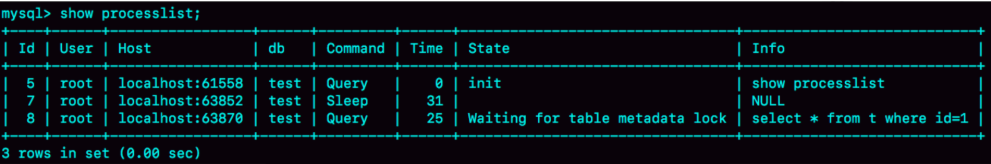

# 基础问题
*  MySQL 执行一条查询语句的内部执行过程？
```
a. 客户端先通过连接器连接到MySQL服务器，建立链接。
b. 先查询数据库缓存是否存在，如果有会直接返回缓存中的数据。如果没有则会进入分析器。
c. 进入分析器后会对查询语句进行语法的分析，检查SQL语句是否存在语法错误，检查通过后会进入优化器。
d. 优化器会对查询语句进行优化处理，比如，若SQL语句用到了多个索引会判断哪个索引性能更好。
e. 最终会进入执行器，开始执行查询语句直到查询出满足条件的所有数据，然后进行返回。
```
* 查询缓存的优缺点
```
优点是增加SQL语句的查询效率。
缺点是任何更新表操作都会清空查询缓存，失效太频繁导致缓存命中率比较低，并且进而会出现内存碎片问题，需要按期对内存碎片进行整理，FLUSH QUERY CACHE 。

查看是否开启查询缓存：
mysql> show variables like "%cache%";
... ...
query_cache_size | xxxxx
query_cache_type | ON/OFF
... ...
查看缓存命中情况：
mysql> show status like "%qcache%";
... ...
Qcache_hits | 0
... ...
临时关闭查询缓存：
set global query_cache_size=0
set global query_cache_type=0
永久关闭查询缓存：
$ vim my.cnf
... ...
query_cache_size=0
query_cache_type=0
... ...
查询SQL语句指定：
select sql_no_cache count(*) from users;
```

# 存储引擎
* InnoDB与MyISAM
```
a. MyISAM 可以不存在主键索引，但InnoDB 必须主键索引。
b. MyISAM 的主键自增值保存在数据文件中，InnoDB 的主键自增值，其实是保存在了内存里，MySQL 8.0 版本后才有了“自增值持久化“的能力，记录在redolog日志中。

```


# 索引
```
索引是一种加快查询数据的数据结构，目的是加快查询的效率。
a. 索引减少了需要扫描的数据行的数量，将原来的全表扫描，使用特定的数据结构，能够快速的定位数据行。
b. 使用有序的索引，避免了排序，将原来的随机的IO操作，变成了顺序的IO操作，执行有序。
创建索引的前提：
a. 表数据量大，因为表数据量小时全表扫描的速度已经很快，创建索引后的维护成本会更高。
b. 字段数据的差异性比较大，因为。
```
* 索引数据结构
```
B+Tree索引：

为什么使用B+Tree结构，而不使用BTree结构？
a. B+Tree的叶子节点存储了行的所有数据，非叶子节点只存储索引数据，而BTree的每个节点都存有索引和数据，
   所以B+Tree的非叶子节点相比于BTree的可以存储更多的键，会带来两方面的优势：第一是树的层级更少，查找更快；第二是一次IO读取的数据页中包含更多的键。
b. B+Tree的每个叶子节点都存有相邻叶子节点的指针，所以叶子节点自身依关键字是有序的，支持顺序和范围查找。

注意，MySQL本身每个表都会有一个主键索引，其底层本身就是按照B+Tree的数据结构存储的。

Hash索引：
常见于Memory数据库引擎，


对比说明一下B+索引和hash索引的优缺点？
优点：
hash索引可以以0(1)的速度查找数据，精确查询的速度更快。
缺点：
a. 数据不是按照索引值顺序存储的，所以无法用于排序。
b. 不支持部分索引列查找，因为哈希索引始终是使用索引列的全部内容来计算哈希码。
c. 只支持等值比较查询，比如 =、IN()，不支持范围查询，比如 price > 100 。
d. 过多的哈希冲突会增加查询时间及索引维护代价。

如何实现可以支持范围查找的Hash索引？
a. LinkedHashMap

b. HashMap+跳表

```
* 索引种类
```
主键索引（PRIMARY KEY）：
主键索引一般是在创建表的时候指定的主键，一个表只有一个主键索引，特点是 唯一、非空。
若未指定主键，Mysql默认会生成一个6字节长的ROWID作为隐含的自动增长主键作为主键索引。

唯一索引（UNIQUE）：
与主键索引的区别是唯一索引允许为空，但以NULL为条件查询不走索引，一般使用 空字符 代替 NULL。
其特点就是唯一性，在实际中更多的是用来保证数据的唯一性，否则可用普通索引代替。
组合索引也可以是唯一索引，只要保证创建的列值是唯一的。

普通索引（INDEX）：
不多说。

组合索引（INDEX）：
组合索引即用多个字段创建一个索引，相对于多字段的单列索引，组合索引的查询效率更高，其查询遵循 最左前缀原则。

全文索引（FULLTEXT）：
针对一些大的文本字段创建的索引。

前缀索引：
针对内容比较长，而且前几位的差异性已经非常大的数据字段，可以创建前缀索引， index(field_name(6)) 。
前缀索引能有效减小索引文件的大小，让每个索引页可以保存更多的索引值，从而提高了索引查询的速度。
但前缀索引也有它的缺点，不能在 order by 或者 group by 中触发前缀索引，也不能把它们用于覆盖索引。

```
* 回表查询
```
回表查询简单来说就是「通过二级索引查询数据，得不到完整的数据行，需要再次查询主键索引来获得数据行」。

聚簇索引：
主键索引是聚簇索引，其叶子节点保存着完整的数据行。

非聚簇索引：
其叶子节点保存主键索引ID，通过这类索引查询数据需要回表查询。
```
* 索引覆盖
```
查询数据列只用从索引中就能够取得，不必从数据表中读取，换句话说查询列要被所使用的索引覆盖。
这类查询可以避免再次回表查询，速度较快。
所以「组合索引」在一定程度上能够避免「回表查询」，因为组合索引的叶子节点包含多个字段。
```
* 最左前缀原则
```
组合索引组织B+Tree的数据方式：
在创建索引时，排序优先级按照组合中从最左边的顺序优先排序，遵循 最左前缀原则。

组合索引的查询过程：
对于 (name,age,sex) 的组合索引，name,age,sex/name,age/name 都会走索引，但是 age,sex 不走索引。

Like模糊查询：
模糊查询字符串也是遵循最左前缀原则的，'x%'会走索引，而'%x%'不走索引。
```
* 索引原则和优化
```
a. 索引列不要在表达式中出现，这样会导致索引失效，如：SELECT * FROM table WHERE id+1=5 。
b. 尽量不要在条件NOT IN、<>、!= 中使用索引。
c. 在索引列的字段中不要出现NULL值，NULL值会使索引失效，可以用特殊的字符比如空字符串或者0来代替NULL值。
d. 联合索引的查询应该遵循最左前缀原则。
e. 一般对于区别性比较大的字段建立索引，在联合索引中区别性比较大(识别度比较高)放在最前面，提高索引的命中率。
f. 索引的大小要适度，不宜过大，避免索引的冗余。
```
* 常见问题
```
为什么 MySQL 官方建议使用自增主键作为表的主键？
a. 可以避免页分裂。
b. 数据存储空间占用小。

页分裂：
索引数据在底层是以数据页为单位来存储的，一个数据页大小默认为 16k，也就是说如果一个数据页存满了，mysql 就会去申请一个新的数据页来存储数据。
为了确保索引有序，如果是自增ID，本身就是顺序写，而自定义ID需要放在合适的位置上，从而导致已保存的索引数据在数据页之间挪动，一条数据可能被分散在两个页空间上，并且大量移动数据会严重拖慢插入效率。

```
# 锁
* MySQL 中提供了几类锁？
```
MySQL提供了全局锁、表级锁和行级锁，其中InnoDB支持表级锁和行级锁，MyISAM只支持表级锁。
```
* 共享锁与排它锁
```
共享锁又称读锁（S锁），共享锁就是多个事务对于同一数据可以共享一把锁，都能访问到数据，但是只能读不能修改。
排他锁又称写锁（X锁），其具有排他性，一个事务获取数据行的排它锁后，其他事务就不能再获取该数据行的其他锁，包括共享锁和排他锁，但是获取排他锁的事务是可以对数据就行读取和修改。

InnoDB引擎默认的修改语句(INSERT/DELETE/UPDATE)都会自动给涉及到的数据行加上排他锁，但查询语句SELECT默认不会加任何锁类型，可以使用select ...for update语句加排他锁，使用select ... lock in share mode语句加共享锁。
注意加过排他锁的数据行在其他事务中是不能被修改的，也不能通过for update和lock in share mode锁的方式查询数据，但可以直接通过select ...from...查询数据，因为普通查询没有任何锁机制。
```
* InnoDB 如何实现行锁？
```
a. 对索引项加锁实现，用相等条件检索数据。
b. 对索引项之间的间隙实现，用范围条件而不是相等条件检索数据。
如果不使用索引条件检索数据，那么InnoDB将对表中的所有记录加锁，实际效果跟表锁一样。
```
* 悲观锁和乐观锁
```
悲观锁：
完全保证数据的独占性和正确性，因为每次请求都会先对数据进行加锁， 然后进行数据操作，最后再解锁，而加锁释放锁的过程会造成消耗，所以性能不高。
手动加悲观锁：
// 读锁
lock tables test_xx read;
unlock tables;
// 写锁
lock tables test_xx write;
unlock tables;

乐观锁：
乐观锁是对于数据冲突保持一种乐观态度，操作数据时不会对操作的数据进行加锁，只有到数据提交的时候才通过一种机制来验证数据是否存在冲突(一般是通过加版本号然后进行版本号的对比方式实现)。
它没有对数据加锁和解锁的过程，这种方式大大的提高了数据操作的性能。
```
* 优化锁方面你有什么建议？
```
mysql> show status like 'innodb_row_lock%';
Innodb_row_lock_current_waits：当前正在等待锁定的数量；
Innodb_row_lock_time：从系统启动到现在锁定总时间长度；
Innodb_row_lock_time_avg：每次等待所花平均时间；
Innodb_row_lock_time_max：从系统启动到现在等待最常的一次所花的时间；
Innodb_row_lock_waits：系统启动后到现在总共等待的次数；

查询正在被锁阻塞的sql语句：
mysql> SELECT * FROM information_schema.INNODB_TRX\G;

a. 尽可能让所有数据检索都通过索引来完成，避免无索引行锁升级为表锁。
b. 尽可能较少检索条件，避免间隙锁。
c. 尽量控制事务大小，减少锁定资源量和时间长度。
d. 锁住某行后，尽量不要去调别的行或表，赶紧处理被锁住的行然后释放掉锁。
e. 涉及相同表的事务，对于调用表的顺序尽量保持一致。
```

# 事务
* 特性
```
* 原子性

```
* 并发问题
```
脏读：
一个事务读取到另一个事务「还未提交」的数据。

不可重复读：
指在同一个事务内，两次相同的查询因为其他事务对数据进行了修改或删除而返回了不同的结果。

幻读：
一个事务前后两次查询中，其他事务在其查询的范围结果内插入了新的数据行，导致前后两次查询数据不一致。

不可重复读和幻读区别：
两者的表象很像，都是两次查询结果不一致。
但解决不可重复读只需要锁住满足条件的数据行（不允许其他事务更新和删除）即可，而解决幻读必须锁住满足条件的数据行及行间隙（不允许其他事务新增）才行。
所以不可重复读重点在于 数据的更新和删除操作，而幻读重点在于数据的插入操作。
```
* 隔离级别
```
Read uncommitted（未提交读）：
在该隔离级别，所有事务都可以看到其他事务未提交的数据。
该级别会出现「脏读、不可重复读、幻读」现象。

Read committed（已提交读）：
在该隔离级别，所有事务只能看到其他事务的已提交数据。
该级别会出现「不可重复读和幻读」现象。

Repeatable read（可重复读）：
MySQL的默认事务隔离级别，在该隔离级别，保证同一事务内的多次查询返回的数据结果一致。
该级别会出现「幻读」现象。

Serializable（可串行化）：
它强制事务都是串行执行的，使之不可能相互冲突。在这个隔离级别，可能导致大量的超时现象和锁竞争。

```
* MVCC（多版本并发控制）
```
基于乐观锁理论实现隔离级别的方式，用于实现已提交读和可重复读隔离级别。
隐藏列：
a. 行的创建版本号
b. 行的删除版本号

事务版本号：
每次事务开启前都会从数据库获得一个自增长的事务ID，可以从事务ID判断事务的开始执行的先后顺序。

INSERT操作：
插入一条新数据行，行的创建版本号为当前事务的版本号。
DELETE操作：
更新数据行的删除版本号为当前事务的版本号。
UPDATE操作：
a. 插入一条新数据行，行的创建版本号为当前事务的版本号。
b. 更新旧数据行的删除版本号为当前事务的版本号。
SELECT操作：
a. 必须满足行的创建版本号小于或等于当前事务的版本号，
   以确保事务读取的行，要么是在事务开始前已经存在，要么是事务自身插入或修改的数据行。
b. 必须满足行的删除版本号为NULL或大于当前事务的版本号，以确保事务读取到的数据行，在事务开始之前未被删除。


优缺点：
通过两个额外版本号字段，维护数据历史版本，从而解决并发事务访问情况下的读一致性问题，并且它能够使大多数读操作都可以不用加锁。
不足之处是每行记录都需要额外的存储空间，需要做更多的行检查工作，以及一些额外的维护工作。
```

# MySQL日志
* redo log 和 binlog 有什么区别？
```
redo log 记录的是内存数据页上做了什么修改，它是循环写的，会出现覆盖。
binlog 记录的是磁盘数据上做了什么修改，是追加写入的，不会出现覆盖。
```
* 什么是脏页和干净页？
```
频繁的更新操作，都是在写内存和日志，并不会马上同步到磁盘上，这时内存数据页跟磁盘数据页内容不一致，我们称之为脏页。
数据落盘（将脏页数据同步到磁盘中）过程中，将停止所有的更新操作，因为要保证内存数据页数据完整同步。
落盘触发点：
a. redo log写满了。
b. 系统内存不足时。
c. 间隔刷新落盘。
d. MySQL服务关闭时。
```

# SQL优化
* 慢日志
```
开启：

Explain重要字段：
a. id
表示SELECT语句的序列号，它是SQL执行顺利的标识。

b. select_type
表示查询的类型，主要用于区别普通查询、联合查询或子查询等复杂查询。

c. table
d. partitions
e. type
f. possible_keys
g. key
h. key_len
i. ref
j. rows
k. filtered
l. Extra
它显示了重要的额外信息。
Using filesort
```
* or
```
使用or的时候是不会用到索引的，可以使用union代替。
MySQL 5.0之后，引入 索引合并优化(Index merge optimization)机制，它针对查询中单张表可以使用多个索引时，会同时扫描多个索引并将扫描结果进行合并。
三种场景：
a. 对OR语句求并集
SELECT * FROM TB1 WHERE c1="xxx" OR c2=""xxx"
如果c1和c2列上分别有索引，可以按照c1和c2条件分开查询，再将查询结果合并操作，得到最终结果。
b. 对AND语句求交集
SELECT * FROM TB1 WHERE c1="xxx" AND c2=""xxx"
如果c1和c2列上分别有索引，可以按照c1和c2条件分开查询，再将查询结果取交集操作，得到最终结果。
c. 对AND和OR组合语句求结果

该机制的问题：
以SELECT * FROM TB1 WHERE c1="xxx" AND c2=""xxx" 为例。
当c1列和c2列选择性较高时，按照c1和c2条件进行查询性能较高且返回数据集较小，再对两个数据量较小的数据集求交集的操作成本也较低，最终整个语句查询高效；
当c1列或c2列选择性较差且统计信息不准时，比如整表数据量2000万，按照c2列条件返回1500万数据，按照c1列返回1000条数据，此时按照c2列条件进行索引扫描+聚集索引查找的操作成本极高(可能是整表扫描的百倍消耗)，对1000条数据和1500万数据求交集的成本也极高，最终导致整条SQL需要消耗大量CPU和IO资源且相应时间超长，而如果值使用c1列的索引，查询消耗资源较少且性能较高。
考虑上边原因，绝大多数都会选择关闭该特性来避免执行异常。
```
* 大表分页查询的Limit性能问题
```
SELECT a,b,c FROM table WHERE xx= '' and yy = '' LIMIT 1000000,20;
优化：
SELECT  t.a,t.b,t.c FROM table t 
RIGHT JOIN (
SELECT id  -- 只查id列
FROM table
WHERE xx= '' and yy = ''
LIMIT 1000000,20
) as b ON b.id = t.id;
由于非聚簇索引的叶子节点上面存储的是主键的id，因此，如果select只查主键，就不需要再回表查询了。
limit是在查询结果基础上跳过多少条记录，也就是说，跳过多少条记录也是需要查询这些记录的信息的。
如limit 10000,20，那么就需要10020次根据主键id到聚簇索引上面取记录信息，而select id就能减少这10020次查询，因为非聚簇索引上面存的就是主键id。
前提是where后面的条件必须确保都是走索引，在全表扫描下，任何优化都是徒劳。

```
# 常见问题
* 查询长时间不返回可能是什么原因？应该如何处理？
```
a. 锁等待
mysql> show processlist;
```


```
表示现在有个线程正在表 t 上持有表写锁，把 select 语句阻塞了。
找到表锁占用：
mysql> select blocking_pid from sys.schema_table_lock_waits;
找到行锁占用：
mysql> select * from t sys.innodb_lock_waits where locked_table='`test`.`t`'\G

用kill命令断开。

b. 等flush
mysql> select * from information_schema.processlist where id=1;
```

```
可以查看出该线程的状态是Waiting for table flush;

c. 慢查询
```
